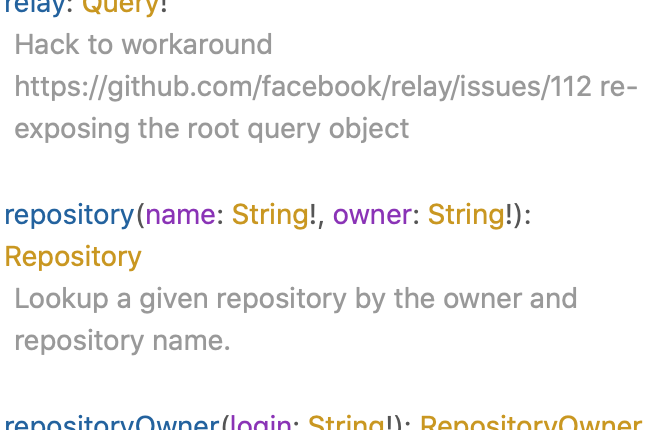

# SCHEMA

Provides object types used in data. Specifies types for all values.

Allows API to be self-documenting. In playground, click **Docs** to open.



## Define

```javascript
// type definitions (schema)
const typeDefs = `
  type Query {
    hello: String!
  }
`
```

Must define all types of schema. `Query` is built-in type, should contain all queries.

## Required Field

Field with `!` after type always returns value. Otherwise can be `null`.

`email: String!`

## Scalar Types

1. `String`
2. `Boolean`
3. `Int`
4. `Float`
5. `ID` - like string, but with differences, specifically for identifier

## Resolvers

`typeDefs` define operations, resolvers contain implementations. Mirrors `typeDefs`, but value of each operation is function.

```javascript
const typeDefs = `
  type Query {
    id: ID!
    name: String!
    age: Int!
    employed: Boolean!
    gpa: Float
  }
`

const resolvers = {
  Query: {
    id() {
      return 'abc123' // could be 12, which would be converted to '12'
    },
    name() {
      return 'John Smith'
    },
    age() {
      return 35
    },
    employed() {
      return true
    },
    gpa() {
      return null
    }
  }
}
```
